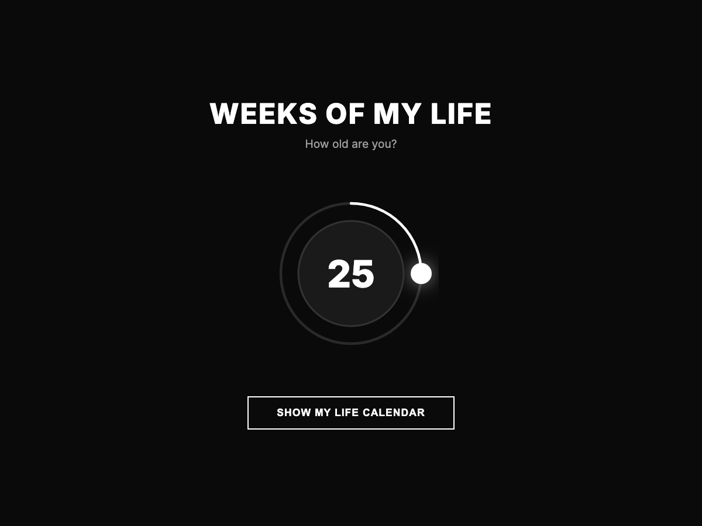

# Weeks of My Life

Visualize your life in weeks — one dot per week, a reminder to make each one count.



Enter your age and see your whole life laid out as a grid. Explore stats, milestones, a bucket list, mood heatmap, and rotating **Memento Mori** quotes.

## Run it

No build step. Just open `index.html` in a browser:

```bash
open index.html
```

Built with plain HTML, CSS, and JavaScript.
